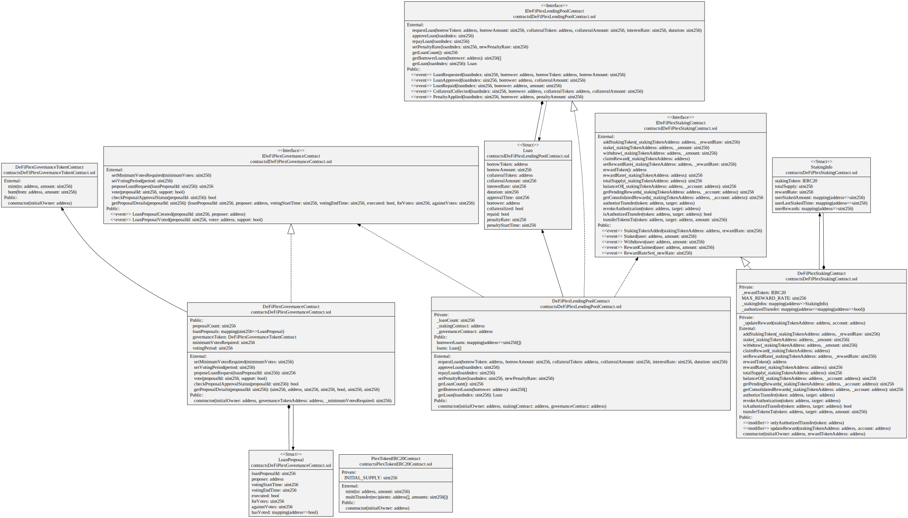
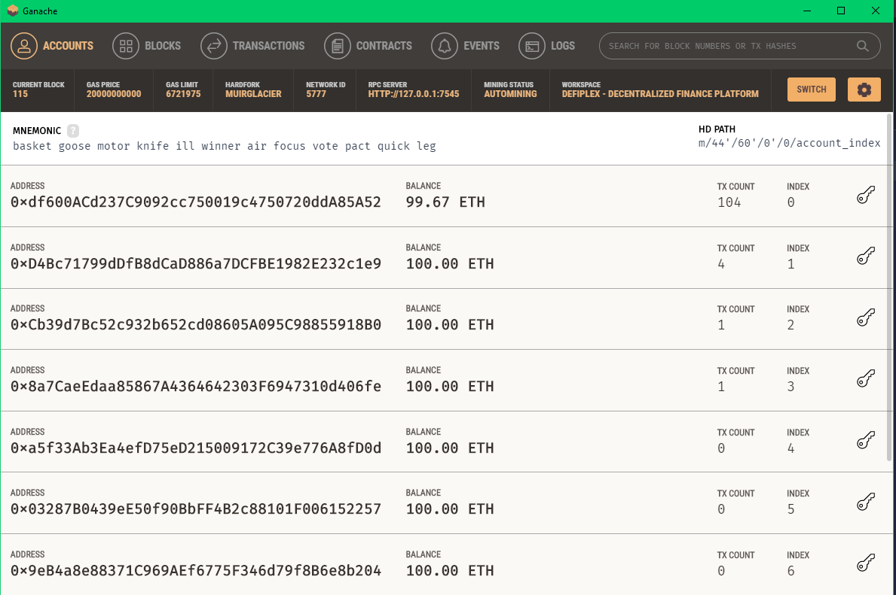

# 🌐 DeFiPlex - Decentralized Finance Platform on Polygon

🌐 DeFiPlex is a comprehensive decentralized finance (DeFi) platform built on the Polygon blockchain, a Layer 2 scaling solution for Polygon. It aims to facilitate a wide array of decentralized financial activities, making it accessible and efficient for users across the globe. Whether users are looking to stake their assets to earn rewards, participate in decentralized lending and borrowing markets, or engage in community-driven governance decisions, DeFiPlex provides a seamless and secure environment.

🔗 Powered by smart contracts, DeFiPlex ensures unparalleled transparency by executing transactions in a trustless manner, thereby eliminating the need for intermediaries. Security is paramount, with robust protocols and audits in place to safeguard user funds and maintain the integrity of the platform.

<p align="center">
  
  
  
  
  
  
</p>

### Key Features

- 🔐 **Staking**: Users can stake their tokens in DeFiPlex to earn rewards, securing the network and earning passive income based on their stake amount and duration.

- 💰 **Reward Distribution**: DeFiPlex distributes rewards to users who stake their tokens. Rewards are calculated based on the staked amount and duration, available for periodic claiming.

- 💸 **Lending and Borrowing**: The platform allows users to lend and borrow assets directly, earning interest by lending assets or paying interest to borrow assets, thereby creating a decentralized money market.

- 🗳️ **Governance**: DeFiPlex incorporates a robust decentralized governance framework empowering token holders to actively participate in decision-making, including loan approval processes. The community votes on key proposals related to loan approvals, ensuring transparent and democratic decision-making reflecting the collective interests of platform users.

### Smart Contracts

- 📜 **Staking Contract**: Manages token deposits, tracks user balances, calculates staking rewards, and facilitates reward claims.

- 📜 **Lending Pool Contract**: Enables lending and borrowing functionalities, manages loan requests, and ensures loan repayment mechanisms.

- 📜 **Governance Token (FlexTokenERC20Contract)**: Implements the governance token used for voting and decision-making within the platform.

- 📜 **Governance Contract (DefiFlexGovernanceContract)**: Facilitates governance processes by managing proposals and ensuring transparent voting mechanisms. It requires a minimum threshold of votes over a specified voting period for loan approvals, ensuring community consensus.

## UML Design Diagram
Complete UML diagram of decentralized application design.



### Governance Mechanism for Loan Approval 📜🗳️
The DeFiPlex governance system plays a crucial role in loan approval processes. Here are its key components:

* **Proposal Creation: 📝** Users can create loan proposals detailing loan conditions, terms, and collateral requirements.

* **Voting: 🗳️** Token holders participate in governance by voting on submitted loan proposals. Each token represents one vote, encouraging active participation and stakeholder engagement.

* **Threshold Requirements: 📊** Loan proposals must meet a minimum threshold of votes during a specified voting period to be approved. This ensures robust community backing and consensus before final approval.

* **Execution: 🚀** Once a loan proposal meets the voting requirements, it is automatically executed via smart contracts. This includes disbursing loan funds and implementing agreed-upon terms.

### Security Considerations

- 🔍 **Auditing**: All smart contracts undergo rigorous audits conducted by reputable security firms to ensure robustness and protection against vulnerabilities.

- 🔒 **Access Control**: Critical parameters such as reward rates are securely controlled, with restricted access limited to authorized entities only.

- 🧪 **Testing**: Comprehensive testing is conducted on testnets prior to mainnet deployment to validate contract functionality and security measures.

DeFiPlex is committed to providing a secure and versatile platform for decentralized financial activities. By leveraging smart contracts and the Polygon blockchain, DeFiPlex offers a transparent and efficient way to engage in staking, lending, borrowing, and governance processes.

### Technology Stack

DeFiPlex leverages a robust technology stack to ensure scalability, security, and efficiency across its decentralized finance platform:

- 🛠️ **Polygon Blockchain**: DeFiPlex is built on the Polygon blockchain, benefiting from its high throughput, low transaction fees, and interoperability with Polygon.

- 💻 **Solidity**: Smart contracts in DeFiPlex are written in Solidity, the predominant programming language for Polygon-compatible blockchains, ensuring compatibility and reliability.

- 📦 **OpenZeppelin**: OpenZeppelin's library is extensively used for secure and standardized smart contract components. It provides tested and audited implementations of ERC standards and contract functionalities, enhancing security and reliability.

- ⚙️ **Hardhat**: Hardhat serves as the development environment for DeFiPlex, facilitating tasks such as compiling, testing, and deploying smart contracts. It supports a wide range of plugins and tools essential for robust contract development and deployment.

### Key Technologies Explained 🛠️📚

#### Polygon Blockchain 🔷

Polygon provides a scalable and Polygon-compatible platform that enhances transaction speeds and reduces costs compared to the Polygon mainnet. DeFiPlex leverages Polygon’s Layer 2 solutions to ensure fast transaction finality and a seamless user experience.

#### Solidity 🖋️

Solidity is the programming language of choice for developing smart contracts on Polygon and compatible blockchains. It enables developers to write secure and efficient contracts, ensuring compatibility with the broader Polygon ecosystem and facilitating seamless integration with decentralized applications (dApps).

#### OpenZeppelin 🔒

OpenZeppelin is a library of reusable and secure smart contract components widely adopted within the blockchain community. DeFiPlex utilizes OpenZeppelin's tested implementations of ERC standards and contract functionalities to enhance security and mitigate potential vulnerabilities.

#### Hardhat 🎩

Hardhat is a popular development environment tailored for Polygon smart contract development. It offers built-in support for tasks such as compiling, testing, debugging, and deploying smart contracts, streamlining the development lifecycle and ensuring the reliability of deployed contracts.

The technology stack behind DeFiPlex underscores its commitment to delivering a secure, scalable, and efficient decentralized finance platform. By leveraging Polygon's blockchain, Solidity smart contracts, OpenZeppelin's library, and the Hardhat development environment, DeFiPlex ensures robustness, security, and interoperability while offering a seamless user experience for staking, lending, borrowing, and governance activities.

## 💼 Unveiling the Intricacies of Smart Contracts: Exploring Their Role and Functionality

### DeFiPlex Staking Contract 🌱

The DeFiPlex Staking Contract allows users to stake multiple ERC20 tokens and earn rewards over time.

```solidity
// SPDX-License-Identifier: MIT
pragma solidity ^0.8.9;

import "@openzeppelin/contracts/token/ERC20/IERC20.sol";
import "@openzeppelin/contracts/token/ERC20/utils/SafeERC20.sol";
import "@openzeppelin/contracts/access/Ownable.sol";
import "./IDeFiPlexStakingContract.sol";

/**
 * @title DeFiPlex Staking Contract
 * @dev A contract that allows users to stake multiple ERC20 tokens and earn rewards over time.
 */
contract DeFiPlexStakingContract is Ownable, IDeFiPlexStakingContract {
    using SafeERC20 for IERC20;
// Contract implementation
}
```

#### Key Features 🚀

- **Stake Tokens:** Users can stake ERC20 tokens into the contract to earn rewards based on predefined rates.
- **Withdraw Tokens:** Users can withdraw their staked tokens at any time, which updates their earned rewards.
- **Claim Rewards:** Users can claim accumulated rewards periodically for each staked token.
- **Manage Reward Rates:** Admins can set and update reward rates for each staking token.
- **Authorization Mechanism:** Provides functionality to authorize specific addresses for token transfers.

#### Contract Events 📜

- `StakingTokenAdded(_stakingTokenAddress, _rewardRate)`: Fired when a new staking token is successfully added.
- `Staked(user, amount)`: Indicates when a user stakes tokens into the contract.
- `Withdrawn(user, amount)`: Indicates when a user withdraws tokens from the contract.
- `RewardClaimed(user, amount)`: Fired when a user claims their accumulated rewards.

#### Governance and Security 🔒

The contract includes mechanisms for secure staking and rewards distribution, ensuring transparency and integrity through blockchain technology.

### DeFiPlexLendingPoolContract 🏦

This contract manages lending and borrowing functionalities within the DeFiPlex platform. It allows users to request loans, approve loans, and repay loans. Additionally, it handles collateral management and penalties for late repayments.

```solidity
// SPDX-License-Identifier: MIT
pragma solidity ^0.8.9;

import "@openzeppelin/contracts/token/ERC20/IERC20.sol";
import "@openzeppelin/contracts/token/ERC20/utils/SafeERC20.sol";
import "@openzeppelin/contracts/access/Ownable.sol";
import "./IDeFiPlexLendingPoolContract.sol";
import "./IDeFiPlexGovernanceContract.sol";
import "./IDeFiPlexStakingContract.sol";

/**
 * @title DeFiPlexLendingPoolContract
 * @dev This contract handles the lending and borrowing functionalities within the DeFiPlex platform.
 * It allows users to request loans, approve loans, and repay loans. Additionally, it manages collateral and penalties for late repayment.
 */
contract DeFiPlexLendingPoolContract is Ownable, IDeFiPlexLendingPoolContract {
     using SafeERC20 for IERC20;
// Contract implementation
}
```
#### Key Functionalities 🛠️:

- **Request Loan (`requestLoan`)** 📝:
  - Allows users to request a new loan by specifying the borrow token, amount, collateral token, collateral amount, interest rate, and duration.
  - Validates input parameters to ensure they meet specified requirements.

- **Approve Loan (`approveLoan`)** ✅:
  - Enables the contract owner to approve a loan after verifying collateral availability and governance approval.
  - Transfers collateral from the borrower to the contract, secures it, and transfers borrowed tokens to the borrower.
  - Records approval and sets penalty start time based on loan duration.

- **Repay Loan (`repayLoan`)** ⏰:
  - Allows borrowers to repay their loans, including interest and any applicable late repayment penalties.
  - Validates borrower identity, loan collateralization status, repayment timing, and calculates repayment amounts including penalties.

- **Set Penalty Rate (`setPenaltyRate`)** ⚠️:
  - Allows the contract owner to set the penalty rate for late loan repayments.

- **Loan Information (`getLoan`, `getLoanCount`, `getBorrowerLoans`)** 📊:
  - Provides functions to retrieve loan details, total loan count, and borrower-specific loan indices for transparency and auditing purposes.

#### Contracts Used 📜:
- **Ownable**: Provides ownership control functionalities.
- **SafeERC20**: Safely handles ERC20 token transfers to prevent common vulnerabilities.
- **IDeFiPlexLendingPoolContract**: Interface for external interactions related to lending pools.
- **IDeFiPlexGovernanceContract**: Interface for governance-related operations.
- **IDeFiPlexStakingContract**: Interface for staking-related operations.

### DeFiPlexGovernanceContract 🗳️

This contract manages governance proposals for the DeFiPlex platform. It facilitates the creation, voting, and execution of proposals related to loans within the ecosystem.

```solidity
// SPDX-License-Identifier: MIT
pragma solidity ^0.8.9;

import "@openzeppelin/contracts/access/Ownable.sol";
import "./DeFiPlexGovernanceTokenContract.sol";
import "./IDeFiPlexGovernanceContract.sol";

/**
 * @title DeFiPlexGovernanceContract
 * @dev This contract manages governance proposals for DeFiPlex platform.
 */
contract DeFiPlexGovernanceContract is Ownable, IDeFiPlexGovernanceContract {
// Contract implementation
}
```

#### Key Functionalities 🛠️:

- **Propose Loan Request (`proposeLoanRequest`)** 📝:
  - Allows any address to propose a new loan request.
  - Initiates a voting period during which token holders can vote on the proposal.

- **Vote on Proposal (`vote`)** 🗳️:
  - Enables token holders to vote either in favor of or against a loan proposal.
  - Votes are weighted by the token balance held by the voter.

- **Check Proposal Approval Status (`checkProposalApprovalStatus`)** ✅:
  - Determines whether a loan proposal has met the criteria for approval.
  - Conditions include surpassing the minimum required votes and having no votes against the proposal.

- **Adjust Voting Parameters (`setMinimumVotesRequired`, `setVotingPeriod`)** ⚙️:
  - Allows the contract owner to set the minimum votes required for proposal approval and adjust the duration of the voting period.

- **Get Proposal Details (`getProposalDetails`)** 📊:
  - Provides access to detailed information about a specific loan proposal, including its initiator, voting period, and current voting status.

#### Contracts Used 📜:
- **Ownable**: Manages ownership and access control over contract functionalities.
- **DeFiPlexGovernanceTokenContract**: Interface to interact with the governance token for voting rights.
- **IDeFiPlexGovernanceContract**: Interface defining the standard functions for governance contracts.
  
## 🛠️ Installation
First, clone the repository:

```bash
git clone https://github.com/sergio11/defiplex_blockchain.git
cd defiplex_blockchain
```

Install the necessary dependencies:

```bash
npm install
```

## 🚀 Usage

### 📜 Deploying Contracts
Deploying the DeFiPlex smart contracts is a straightforward process using **Hardhat Ignition***. This tool simplifies the deployment process, allowing you to deploy your contracts with ease and confidence. Below is a step-by-step guide to deploying the DeFiPlex contracts to your specified network.

Use the following command to deploy the contracts to the specified network (in this case, Polygon amoy):

```shell
npx hardhat ignition deploy ignition/modules/DefiPlex.js --network amoy   
```

Deploying your DeFiPlex contracts with Hardhat Ignition ensures a smooth, efficient, and error-free process, paving the way for a robust and transparent DeFi system.

```bash
√ Confirm deploy to network amoy (80002)? ... yes
Hardhat Ignition 🚀

Resuming existing deployment from .\ignition\deployments\chain-80002

Deploying [ DeFiPlex ]

Batch #1
  Executed DeFiPlex#DeFiPlexLendingPoolContract

[ DeFiPlex ] successfully deployed 🚀

Deployed Addresses

DeFiPlex#DeFiPlexGovernanceTokenContract - 0x8A53E585c5c19b78b03d215a978BAa74f81EE08B
DeFiPlex#PlexTokenERC20Contract - 0xe75457AeFa4D367DFc5495112a60178A8e2A0243
DeFiPlex#DeFiPlexGovernanceContract - 0xbD3a29C9C39E13D4307a9E153468481f63dD606e
DeFiPlex#DeFiPlexStakingContract - 0x7a820E12b5C357f63984dBf9a7b3d17bE1114857
DeFiPlex#DeFiPlexLendingPoolContract - 0xB1D55F4Dfc46905f43A424656584351445956009
```

## 🧪 Testing
Testing is a critical part of the development process for ensuring that our smart contracts function correctly and securely. The DeFiPlex project includes comprehensive test suites for all the contracts. These tests cover a wide range of scenarios to ensure robustness and reliability.

### Running the Tests
To run the tests, use the following command:

```shell
npx hardhat test
```

This command will execute all the test scripts located in the test directory, and you should see output similar to the following:

```shell
DeFiPlexGovernanceContract
    ✔ Should deploy the contract correctly
    ✔ Should allow setting minimum votes required
    ✔ Should allow setting voting period
    ✔ Should propose a loan request
    ✔ Should vote on a proposal
    ✔ Should not approve a proposal if criteria are not met
    ✔ Should approve a proposal if criteria are met
    ✔ Should not approve a proposal if there are votes against it
    ✔ Should revert on trying to vote on non-existent proposal (38ms)
    ✔ Should revert on trying to propose with same ID
    ✔ Should revert when user tries to vote again
    ✔ Should revert when user tries to vote outside voting period
    ✔ Should retrieve correct details of a loan proposal

  DeFiPlexLendingPoolContract
    Loan Requests
      ✔ Should allow users to request a loan
      ✔ Should revert if loan amount is zero
      ✔ Should revert if interest rate is zero
      ✔ Should revert if collateral amount is zero
      ✔ Should revert if duration is zero
    Loan Queries
      ✔ Should return borrower loans correctly
      ✔ Should revert if no loans found for borrower
      ✔ Should return loan details correctly
      ✔ Should revert if loan index is out of bounds
    Loan Approval
      ✔ Should be rejected because insufficient borrow token amount in lending pool
      ✔ Should be rejected because borrower does not have enough collateral tokens
      ✔ Should be rejected because collateral already collected
      ✔ Should be rejected because the loan proposal has not been approved by governance
      ✔ Should be approved successfully
    Loan Repayment
      ✔ Should be rejected because the loan duration not expired yet
      ✔ Should be repay successfuly
      ✔ Should be rejected because loan is already repaid
      ✔ Should be rejected because Only the borrower can repay the loan
      ✔ Should be repay successfuly penalty (45ms)

  DeFiPlexStakingContract
    ✔ Should set the right owner
    Adding Staking Tokens
      ✔ Should allow the owner to add staking tokens
      ✔ Should not allow non-owners to add staking tokens
      ✔ Should not allow adding the same staking token more than once
      ✔ Should revert when adding a staking token with a reward rate of zero
      ✔ Should correctly store staking token info after adding
      ✔ Should emit StakingTokenAdded event when a new staking token is added
      ✔ Should revert if trying to add a staking token with a non-contract address
      ✔ Should not allow adding staking tokens with extremely high reward rates
    Staking Tokens
      ✔ Should allow users to stake tokens
      ✔ Should not allow staking zero tokens
      ✔ Should allow multiple users to stake tokens
      ✔ Should not allow staking more tokens than available
      ✔ Should allow stake and withdraw tokens
      ✔ Should revert if user tries to withdraw more than staked
      ✔ Should revert if contract has insufficient funds for withdrawal
    Withdrawing Tokens
      ✔ Should allow users to withdraw all staked tokens
      ✔ Should not allow withdrawing more tokens than staked
      ✔ Should allow withdrawing tokens and update rewards
      ✔ Should allow withdrawing tokens and update rewards 2
    Claiming Rewards
      ✔ Should allow users to claim rewards
      ✔ Should update user reward after claiming
      ✔ Should not allow claiming zero rewards
      ✔ Should not affect staked balance after claiming rewards
      ✔ Should revert if user tries to claim rewards with no staked tokens
      ✔ Should revert if user tries to claim rewards with no rewards available
    Setting Reward Rate
      ✔ Should allow the owner to set the reward rate
      ✔ Should not allow non-owners to set the reward rate
    Getting Information
      ✔ Should return the correct total supply
      ✔ Should return the correct balance of user
      ✔ Should return the correct earned rewards
      ✔ Should return the correct total rewards accumulated

  PlexTokenERC20Contract
    Deployment
      ✔ Should set the right owner
      ✔ Should assign the initial supply to the owner
    Minting
      ✔ Should allow the owner to mint tokens
      ✔ Should not allow non-owners to mint tokens
    Burning
      ✔ Should allow users to burn their tokens
    MultiTransfer
      ✔ Should allow the owner to transfer tokens to multiple addresses
      ✔ Should not allow non-owners to execute multiTransfer
      ✔ Should revert if arrays length mismatch


  72 passing (9s)
```

You can also use ganache to carry out the tests, for this it is only necessary to use the network option

```shell
npx hardhat --network ganache test
```



Tests provide comprehensive coverage of all DeFiPlex smart contract functionalities, ensuring thorough validation of every aspect of the platform's lending, borrowing, and governance mechanisms. These tests simulate various scenarios, including edge cases and typical user interactions, to verify the robustness, security, and compliance of the smart contracts with the intended DeFiPlex platform specifications. By rigorously testing each function, from loan requests to governance proposals, developers ensure early identification and resolution of potential bugs, vulnerabilities, and unintended behaviors. This approach enhances the overall reliability and trustworthiness of DeFiPlex, fostering confidence among users and stakeholders in the platform's operational integrity.
